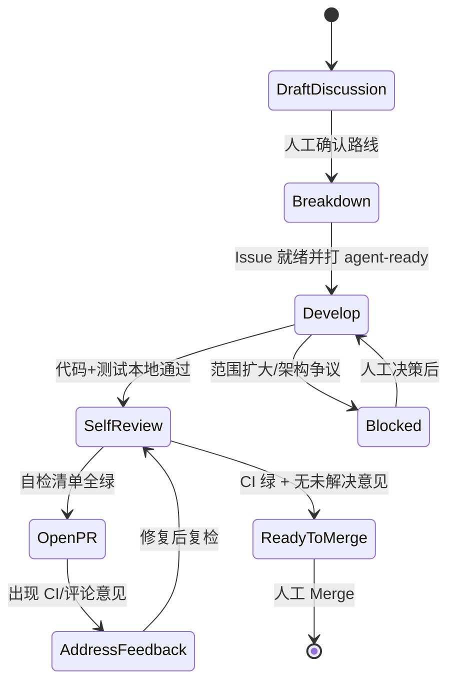

# Epic Delivery Skill

把"一个大目标"变成"一串可被自主交付的小 PR"。本 skill 是编排入口，按状态机推进，每个阶段加载仓库内已有的子 skill 执行具体工作。

本 skill 与具体 Agent 工具无关：凡涉及"会话""调度""事件触发"，均指通用能力，由承载本流程的 Agent 工具自行实现。

## 核心契约

- **一个目标 = 一个 Discussion**：只承载架构总纲与里程碑，不直接放代码。
- **一个可交付步骤 = 一个子 Issue = 一个 Agent 会话（或子 Agent）= 一个 PR**：范围锁死，避免上下文污染导致巨型 PR。
- **编排 Agent 不等反馈**：互不依赖的并行步骤应**同时**派子 Agent 执行，推到 draft PR / ReadyToMerge 后汇总汇报；不要在每个子任务结束时就停下来等人工确认。
- **人工只做两件事**：在 PR 里提意见、点 Merge。
- **Agent 负责其余全部**：拆解、开发、本地验收、自检评审、处理 PR 意见与 CI，推进到"可合并"后停手。

## 适用与不适用

- 适用：跨多个模块 / 多 PR、需要里程碑跟踪的长期演进或大型特性。
- 不适用：单文件小修、一个 PR 能完成的需求（直接开发即可，不必走本流程）。

## 角色与产物

| 角色 | 职责 | 产物 |
|------|------|------|
| Discussion | 架构总纲、演进线、里程碑地图 | 1 篇结构化 Discussion |
| Epic Issue | 总 checklist，进度唯一事实来源 | 1 个 Epic Issue |
| 子 Issue | 一个可交付、可验收的步骤 | N 个子 Issue |
| PR | 一个子 Issue 的实现 | N 个 PR |
| 人工 Maintainer | 架构决策、PR 意见、Merge | 评论 + 合并 |
| 编排 Agent | 识别可并行步骤、派子 Agent、汇总进度 | 并行调度 + Epic 回写 |
| 执行 Agent / 子 Agent | 单 Issue 全闭环（开发→draft PR） | 代码 + 测试 + 自检 + draft PR |

## 交付状态机



| 状态 | Agent 动作 | 加载子 skill | 退出条件 |
|------|-----------|-------------|----------|
| DraftDiscussion | 按模板写路线、依赖图、分阶段表 | `design-document`、`mermaid` | 人工在 Discussion 确认 |
| Breakdown | 拆 Epic + 子 Issue，定义验收标准与范围 | 本 skill `references/` | 每步有 Issue + 验收 + 范围锁 + 依赖 |
| Develop | 在 Issue 范围内实现，本地验收 | `project-knowledge`、`.claude/skills/compile`、`testing-standards`、`e2e`、`selfmonitor` | 本地构建/测试通过 |
| SelfReview | 自查 diff、安全、范围 | `review-standards`、`code-review`、`security-check` | 自检清单全绿 |
| OpenPR | commit + push + 开 PR（先 draft） | `commit` | PR 链回 Issue（`Closes #`） |
| AddressFeedback | 处理评论 / CI，先验证再采纳 | `code-review`、`security-check` | CI 绿 + 无未解决意见 |
| ReadyToMerge | 汇总 test plan，@维护者账号 | — | 停止，等人工 Merge |

## 阶段 0 · 写目标 Discussion

目标：把一个大目标写成可拆解、可跟踪的总纲。

1. 加载 `.skill/skills/design-document`、`.skill/skills/mermaid`、`.skill/skills/project-knowledge`。
2. 用 `references/discussion-template.md` 骨架撰写，必含：总览（几条演进线 + 终态）、分阶段依赖图（Mermaid）、各线现状/目标/工作项表、**代码锚点**（具体 `文件:行`）、风险与约束、里程碑表。
3. 用 `gh` 创建或更新 Discussion；保留人工确认环节。
4. 退出条件：Maintainer 在 Discussion 明确认可路线。

## 阶段 1 · 拆解为 Epic + 子 Issue

拆解原则：

- 每个子 Issue 必须**独立可交付**、**可验收**（有明确构建/测试命令）、**范围可锁**（写清允许改与禁止改的目录）。
- 单 PR 有效 diff 控制在可 review 规模（建议 < ~500 行）；同质批量改动（如多个插件）按目录拆成多个子 Issue。
- 标注依赖：`Blocked by` / `Blocks`；严格顺序的步骤显式串联。

操作：

1. 建 Epic Issue（父 Issue）：总 checklist，用任务列表引用子 Issue（`- [ ] #<子Issue>`）；**Epic checklist 是进度唯一事实来源**。
2. 为每步建子 Issue，套用 `references/github-templates.md`；**创建时挂到 Epic**：

```bash
# 推荐：创建时指定父 Issue
gh issue create --repo <owner>/<repo> \
  --title "[1928-B1] ..." \
  --body-file issue-body.md \
  --label epic,agent-ready \
  --parent <EPIC_NUMBER>

# 或批量创建后逐个关联（比 --add-sub-issue 逗号列表更稳）
for n in 2596 2597 2598; do gh issue edit "$n" --repo <owner>/<repo> --parent <EPIC_NUMBER>; done
```

3. **Issue 正文必须用真实换行**（`--body-file` 或 heredoc），禁止在 bash 双引号里写 `\n`（GitHub 会原样显示 `\n`）。
4. 首次需创建标签（仓库可能尚无）：

```bash
gh label create epic        --color 5319e7 --description "属于某个 Epic 演进"          --repo <owner>/<repo>
gh label create agent-ready --color a2eeef --description "Issue 已写好提示词，可接单"   --repo <owner>/<repo>
gh label create needs-human --color d73a4a --description "Agent 阻塞，需人工决策"       --repo <owner>/<repo>
```

5. 退出条件：每步都有 Issue + 验收标准 + 范围锁 + 依赖关系；已挂为 Epic 子 Issue；阶段 1 项打 `agent-ready`。

## 阶段 2 · 编排 Agent 接单

### 调度原则

| 步骤类型 | 运行方式 | 说明 |
|----------|----------|------|
| 单步小改、范围清晰 | 单 Agent 会话 → 单 PR | 最常见 |
| **互不依赖的并行步骤** | **编排 Agent 同时派多个子 Agent** | 见下节「并行编排」 |
| 同质批量迁移（互不依赖） | 并行子 Agent + 各建 git worktree | 每个 PR 仍锁定单一目录/批次 |
| 跨语言 / 架构敏感 | 单 Agent，控制 PR 规模 | 必要时人工预审 |

接单即用 `references/agent-prompt-template.md` 生成本次任务提示词。**一个 Agent 会话（或一个子 Agent）只做一个 Issue**，禁止在同一会话连做多个步骤。

### 并行编排（子 Agent）

当 Epic 中有多个 **互不依赖** 且已打 `agent-ready` 的子 Issue（例如阶段 1 的 A1 ∥ A2 ∥ B1 ∥ B2），编排 Agent 应：

1. **一次性并行派发**，不要串行「做一个 → 等人工反馈 → 再做下一个」。
2. 每个子 Agent 独立负责一个 Issue 的全闭环：`Develop → SelfReview → OpenPR（draft）→ 在 Issue/Epic 回写 PR 链接`。
3. 子 Agent 推到 **ReadyToMerge** 后**停止**（不 merge）；编排 Agent 汇总各子 Agent 结果，**统一**向人工汇报 batch 状态。
4. 子 Agent 阻塞（`needs-human`）时，编排 Agent 继续推进其它并行项，最后汇总阻塞项。

**派发前检查（每个子 Agent 必做 Preflight）**：

```bash
gh auth status                    # 必须 logged in
git rev-parse --is-inside-work-tree
ssh -T git@github.com 2>&1 | head -1   # push 走 SSH 时必须通
```

**子 Agent 最小权限（当前环境已验证可用）**：

| 能力 | 所需凭证 | 当前状态 |
|------|----------|----------|
| 读/写 Issue、评论、label | `gh` token scope **`repo`** | ✅ |
| 创建 draft PR、PR 评论 | `repo` | ✅ |
| Sub-issue / `--parent` | `repo` | ✅ |
| `git push` 到远程分支 | SSH key（`git@github.com`） | ✅ |
| 改 `.github/workflows/` | token scope **`workflow`** | ❌ 无此 scope，相关 Issue 停手打 `needs-human` |

> 子 Agent 与编排 Agent **共用同一台机器上的 `gh` 配置**（`~/.config/gh/hosts.yml`）和 SSH key；无需单独登录，但 Preflight 失败时必须停止并上报，不得静默跳过 GitHub 操作。

**编排 Agent 派发（所有路径统一用 `dispatch_prompt`）**：

| 场景 | 生成命令 | 编排动作 |
|------|----------|----------|
| PR 评论 / CI 反馈 | `inbox --json` 或 `dispatch-prompt --epic N IC_...` | 复制 `dispatch_prompt` 派 Task |
| 并行新开工（无依赖 Issue） | `dispatch-prompt --epic N --issue M` | 复制输出派 Task |
| merge 解锁后续 Issue | `merge-followup --pr P --json` → `unlocked[].dispatch_prompt` | 每条立即派 Task |

**禁止**手写精简 Task（如「处理 PR #2623 评论」）；子 Agent 无会话记忆，缺 Skills/范围锁/维护者原文会导致实现偏离。详见 `references/executor-dispatch-template.md`。

```bash
# 并行派发 agent-ready 且无 Blocked by 的 Issue（每个 Issue 一条 Task）
./scripts/epic/epic.sh dispatch-prompt --epic <EPIC> --issue <ISSUE_NUMBER>
# 复制 stdout 全文派 Task；子 Agent 回报后再派下一个
```

**编排 Agent 禁止**：

- 串行执行本可并行的 `agent-ready` Issue 并在每个完成后等待人工回复。
- 在一个子 Agent 内塞多个 Issue。
- 子 Agent Preflight 未通过仍强行 push / 开 PR。

### 人工介入时机（仅以下情况才等反馈）

| 时机 | 人工动作 |
|------|----------|
| draft PR 已开、CI/自检完成 | Review，必要时在 PR 提意见 |
| 子 Agent 标记 ReadyToMerge | Merge |
| 打 `needs-human` | 架构/权限决策 |
| Discussion 路线未确认 | 确认后再 Breakdown |

并行 batch 中**部分 PR 等 review、部分仍在开发**是正常状态；编排 Agent 应持续派未开始的并行项，而不是等 batch 全部完成才汇报。

### 感知与调度（编排 Agent 必读 · 必执行）

**编排 Agent 不是 GitHub 常驻监听进程**，但接管某个 Epic 时**必须**启动评论轮询并在会话内持续消费事件。

唯一输入是 **Epic Issue 编号**（如 `#2595`）。`scripts/epic/` 据此自动发现 checklist 子 Issue 与关联 PR，**与具体 Epic 内容解耦**，换 Epic 只改 `--epic` 参数。

#### 编排 Agent 必做（接管 Epic 起）

1. **前台启动 poll** + **监听 `AGENT_TRIGGER_EPIC<N>`**（编排 Agent 会话对 poll 终端 `notify_on_output`）：

```bash
./scripts/epic/epic.sh poll --epic <EPIC_NUMBER>
```

wake 后读 inbox 并处理：

```bash
./scripts/epic/epic.sh inbox --epic <EPIC_NUMBER> --json
```

无 poll 终端时 Agent 可自驱：`inbox --epic <N> --wait 60 --json`。

> 不要用 `nohup`/`&` 脱离会话后台跑 poll——须 IDE 可见以便 monitor 唤醒。

2. **读 `inbox --json` 后派执行 Agent**：复制 **`dispatch_prompt` 全文** 到 Task（含 Skills、worktree、范围锁、维护者意见）；编排 Agent **禁止**亲自改代码。详见 `references/executor-dispatch-template.md`。
   - **`pr_state` MERGED**：先 `merge-followup --pr <n> --json`（含 cleanup），对 `unlocked[]` 每条复制其 `dispatch_prompt` 派执行 Agent，再 `mark-handled`。
   - 派前读子 Issue **`Blocked by`**。

3. **子 Agent 完成后**编排 Agent `mark-handled`（或按回报代 mark）：

```bash
./scripts/epic/epic.sh events --epic <EPIC_NUMBER> mark-handled <comment_id>
```

4. **Epic 交付结束或交还人工** → 停止轮询：前台 `Ctrl-C` 即可；如需从另一终端停，用 `./scripts/epic/epic.sh stop --epic <EPIC_NUMBER>`。

#### 轮询机制摘要

| 项 | 说明 |
|----|------|
| 扫描范围 | Epic Issue + checklist 子 Issue + 关联 PR（Issue/PR/Review 评论 **+ PR 状态 OPEN/MERGED/CLOSED**） |
| 判读 | 无 `from=agent` → 待处理；`action=none/fyi` 的 Agent 评 → 跳过（见 `comment-convention.md`） |
| **PR 状态事件** | PR 合并/关闭产生 `pr_state` 事件 → 编排 Agent 执行 **`merge-followup`**（勾选 checklist、清理 wt、更新/解锁后续 Issue、**立即派执行 Agent**） |
| **Agent 唤醒** | 有 pending 时 poll 打印 `AGENT_TRIGGER_EPIC<N>` JSON → 编排 Agent monitor 后读 `inbox --json` |
| 状态目录 | `/tmp/epic-<EPIC>-poll/`（`seen-ids.txt`、`events.jsonl`、`poll.log`） |
| 间隔 | 默认 60s（`epic.env` 的 `INTERVAL` 或 `--interval`） |

人工在 PR/Issue 评论后的路径：

1. `epic.sh poll` → **`AGENT_TRIGGER`** → 2. 编排 Agent `inbox` → **3. 派执行 Agent** AddressFeedback → 4. 编排 `mark-handled` → 5. ReadyToMerge 后等人工 Merge。

「并行不等反馈」仅指：**不因某个 PR 被 comment 就阻塞其它并行 Issue 的开发**；评论处理由轮询 + 编排派发完成。

完整命令、路由规则见 **`references/orchestration-model.md`**。

## 阶段 3 · 开发

1. 建特性分支：`<type>/<epic>-<step>-<slug>`（如 `feat/pipeline-b1-passthrough`），**分支建在个人 fork（`origin`）**，由 fork 向主仓提 PR；**禁止**直接在主仓建远端分支（见下「分支与推送」）。并行推进多个步骤时，为每个步骤建独立 worktree（见下）。
2. 先读 `.skill/skills/project-knowledge` 建立架构认知；按改动范围读 `.claude/skills/compile`、`testing-standards`、`e2e`、`selfmonitor`。
3. 严格在 Issue 范围内实现，不顺手改其它目录。
4. 本地验收（见矩阵），全部通过再进入自检。

### 并行开发（git worktree）

多个互不依赖的 Issue 可在**各自的 worktree** 内并行开发：每个 worktree 一条分支、一次会话、一个 PR，工作区与构建产物互相隔离，无需来回切分支。优先用 `epic.sh wt` 统一创建/推送/开 PR/清理（自动按约定命名、推 fork、从 fork 提 PR）：

```bash
# 为某步骤创建独立 worktree + 分支（基于 upstream 默认分支）
./scripts/epic/epic.sh wt new --epic <EPIC> --step <step> --slug <slug>
./scripts/epic/epic.sh wt push --epic <EPIC> --step <step>      # 推到 fork（origin）
./scripts/epic/epic.sh wt pr   --epic <EPIC> --step <step> [--draft]  # 从 fork 向 upstream 开 PR
./scripts/epic/epic.sh wt ls                                     # 列出 worktree
./scripts/epic/epic.sh wt rm   --epic <EPIC> --step <step>       # PR 合并后清理
```

> 历史遗留：分支若已建在主仓，则后续仍推主仓远端维护，不要中途搬家。新分支一律走 fork。

约束：

- 一个分支只在一个 worktree 检出；不同 worktree 不要切到同一分支。
- 构建产物（`build/`、`*.gcda`、插件 so）按 worktree 隔离，避免并行构建互相污染。
- 仍遵守"一个会话只做一个 Issue"：并行的是多个 worktree，不是一个会话里连做多步。

### 分支与推送（必遵，避免推错远端 / 污染主仓）

- 新建远端分支一律建在**个人 fork**（`origin` 指向 fork），由 fork 向主仓（`upstream`）提 PR；不要直接在主仓建分支。
- 推送前**二次确认目标远端**，不要想当然 `git push origin`：
  - `git remote -v` 区分 fork 与主仓；`git rev-parse --abbrev-ref @{u}` 确认上游指向正确。
  - 已有 PR 的分支：`gh pr view <pr> --json headRepositoryOwner,headRefName` 查 PR head 实际所在 repo，推到该远端（历史遗留分支即便在主仓也照旧）。
  - push 后用 `gh pr view <pr> --json headRefOid` 核对远端 head == 本地 HEAD，确认推送真正生效。

### 验收命令矩阵

| 变更范围 | 必跑 | 子 skill |
|----------|------|----------|
| Go 插件 | 插件单测 + lint | `.claude/skills/compile`、`testing-standards` |
| 插件管理 | pluginmanager 单测 | `.claude/skills/compile` |
| C++ core | 对应目录 core 单测 | `.claude/skills/compile` |
| 配置 / Pipeline 行为 | E2E（指定 case） | `e2e`、`e2e-manual` |
| 自监控 | monitor 单测 + E2E | `selfmonitor` |
| 仅文档 | 链接 / 渲染检查 | — |

具体命令以各子 skill 为准（避免本 skill 与子 skill 双写漂移）。

### C++ 验收（禁止「本地无 cmake / 待 CI」）

涉及 `core/` 的 PR **必须**加载并执行 `.claude/skills/compile/SKILL.md`：

1. 本机无 devtoolset/cmake 时，用 **CI 同款 Docker 构建**（不是跳过）：

```bash
git submodule update --init core/_thirdparty/coolbpf
export MAKE_JOBS=16 BUILD_LOGTAIL=OFF BUILD_LOGTAIL_UT=ON WITHSPL=ON BUILD_TYPE=Debug
make core PATH_IN_DOCKER=$(pwd)
./scripts/run_core_ut.sh --gtest_filter='<YourTest>.*' unittest/<path>/<test_binary>
```

2. Test plan / PR 评论须贴 **实际 PASS 输出**（命令 + 摘要），**禁止**写「本地无 cmake，待 CI 验证」作为验收替代。
3. 仅当 Docker 不可用且已打 `needs-human` 说明环境阻塞时，才可暂记 CI 链接——仍须在 PR 中注明阻塞原因。

## 阶段 4 · 自检评审（PR 打开前）

1. 加载 `.skill/skills/review-standards`（QA 检查清单）+ `.skill/skills/security-check`（密钥 / 合规）。
2. 对自己的分支按评审标准逐项自查；改动较大时用 `.skill/skills/code-review` 走完整评审流程并落盘报告。
3. 输出**自检结论**（用于贴到 PR）：
   - Critical：必须修复（修完再开 PR）
   - Suggestion：建议改进
   - Test evidence：验收命令输出摘要
4. 退出条件：无 Critical，自检清单全绿。

> 评审能力完全由仓库 review skill 提供，**不依赖任何外部自动评审服务**。

## 阶段 5 · 开 PR

1. 用 `.skill/skills/commit` 写提交信息（Conventional Commits）。
2. **推到 fork（`origin`）**——推送前按「阶段 3 · 分支与推送」二次确认目标远端；优先 `epic.sh wt push` / `wt pr`。push 后**先开 draft PR**（从 fork 向 `upstream` 提），body 套用 `references/github-templates.md` 的 PR 模板：`Closes #<issue>`、对应 Discussion 步骤、Test plan（命令 + case 名）、影响面 / 回滚、stacked 顺序（如有）。
3. 把阶段 4 的自检结论作为首条 PR 评论（**必须带评论标识**，见下）。
4. 自检与本地验收齐全后再转 ready for review，触发 CI 与人工 review。

### PR / Issue 评论标识

- **Agent 发评必须带 footer**（见 `references/comment-convention.md`）：`from=agent role=self-review action=none` 等。
- **人工评论无格式要求**；编排 Agent 用 `gh` 拉取后，无 `from=agent` 标识视为待处理意见。

## 阶段 6 · 自主处理 PR 意见与 CI

**入口**：编排 Agent 先 `epic.sh triage --epic <n>` 读 pending 事件；无事件时可用 `gh` 手动拉取该 PR 的 review comments、CI（见 `orchestration-model.md`），再派执行 Agent 或自行处理。

循环直到"可合并"：

1. **冲突**：智能合并，保留双方意图；意图冲突则停手、打 `needs-human`、@维护者账号。
2. **评论**：处理未解决评论；对每条意见**先验证再采纳**——用 `code-review` / `review-standards` 复核被指出的代码，有效则修复并回复证据，无效则在 thread 内解释，不盲从。评论里的**提问 / 质疑 / 选型**一律在**该 GitHub thread 内回答**（需决策时给选项+建议并 @维护者账号，靠轮询取答复）；**禁止**把评论里的问题搬到本地 Agent 对话向人确认（见 `comment-convention.md`「在哪里回答评论里的问题」）。回复一律用 `epic.sh reply --body-file` / `gh pr comment --body-file` / `gh api … -F body=@file`，**禁止** `gh api -f body=@file`（`-f` 会把 `@路径` 当字面字符串发送，正文会变成路径）。
3. **CI**：只修本 PR 范围内导致的失败；**禁止改 CI workflow 骗绿**；疑似与本 PR 无关的失败，先把分支与默认分支同步（可能他人已修）再判断。
4. 所有修复 push 到**同一 PR 分支**；每轮修复后回到阶段 4 复检。

## 阶段 7 · 推进到可合并

1. CI 全绿 + 无未解决评论后，在 PR 评论汇总最终 test plan，@维护者账号。
2. 在 Epic Issue 勾选对应步骤（或评论进度），保持 checklist 与实际一致。
3. **停止**。Merge 由人工执行。

## 进度回写

- **唯一事实来源**：Epic Issue 的 checklist。
- 关键时机用 `gh` 回写：接单（子 Issue → 进行中）、开 PR（Epic 勾选 + 贴 PR 链接）、ReadyToMerge（@维护者账号）、阻塞（打 `needs-human`）。
- Discussion 仅作静态总纲，按里程碑手动同步快照，不逐 PR 更新。

## 护栏（Agent 必须遵守）

- 不得 merge、不得 approve 自己的 PR。
- 不得 force-push（除非人工显式要求）、不得 skip hooks。
- 不得修改 CI workflow 使检查通过。
- 范围扩大、架构争议、需产品决策 → 立即停止，打 `needs-human`，@维护者账号，不擅自扩大改动。
- 每个 PR 必须带 UT 或 E2E；无测试不进入 ReadyToMerge。
- 一个会话只做一个 Issue；不在同一分支堆叠多个不相关步骤。
- 涉及 `.github/workflows/` 等需要 **`workflow` scope** 的改动，Preflight 确认无权限则停手打 `needs-human`。
- **编排 Agent 不得**在可并行步骤上串行等待人工；应派子 Agent 并行推进。
- **编排 Agent 不得**在 `AGENT_TRIGGER` / AddressFeedback 路径上亲自改代码、checkout 分支或跑长时构建；应 **Task 派执行 Agent**，自身继续 poll / 调度。

## 子 Skill 索引

| 阶段 | 子 skill |
|------|----------|
| DraftDiscussion | `.skill/skills/design-document`、`.skill/skills/mermaid` |
| Develop | `.skill/skills/project-knowledge`、`.skill/skills/compile`、`.skill/skills/testing-standards`、`.skill/skills/e2e`、`.skill/skills/e2e-manual`、`.skill/skills/e2e-develop-guide`、`.skill/skills/selfmonitor` |
| SelfReview / AddressFeedback | `.skill/skills/review-standards`、`.skill/skills/code-review`、`.skill/skills/security-check` |
| OpenPR | `.skill/skills/commit` |

## 沉淀形态说明

本自动化逻辑以 **skill** 形态沉淀（本文件 + `references/` 模板）。原因：流程含分支与状态机，适合"指导执行步骤"的 skill，而非"约束行为"的 rule。

| 载体 | 内容 |
|------|------|
| `SKILL.md` | 状态机、并行编排、**编排 Agent 必执行轮询** |
| `references/orchestration-model.md` | 轮询 / Triage / 派发 / 脚本参考 |
| `references/executor-dispatch-template.md` | **执行 Agent 派发 + Skills 清单** |
| `references/comment-convention.md` | **PR/Issue 评论标识**（Agent footer） |
| `references/github-templates.md` | Issue / PR 模板 |
| `scripts/epic/epic.sh` | **单一入口**：`poll`/`inbox`/`dispatch-prompt`/`merge-followup`/… |
| `scripts/epic/dispatch-enrich.sh` | MD 模版 + `gh` 生成 `dispatch_prompt`（纯 shell） |
| `references/dispatch-*.md.tpl` | **派发正文模版**（AddressFeedback / Develop） |
| `scripts/epic/dispatch-hook.sh` | 可选 bash hook（`AUTO_DISPATCH=true` 时） |

默认部署：**poll + monitor `AGENT_TRIGGER` → 编排 Agent 只 triage/派发 → 执行 Agent 改代码/回复**。

## 禁止行为

- 不把多个步骤塞进一个会话 / 一个 PR。
- 未获人工确认路线前，不大规模建 Issue。
- 不盲从自动或人工评论意见，未验证不修改。
- 不绕过验收（无测试、改 CI 骗绿、force-push 掩盖问题）。
