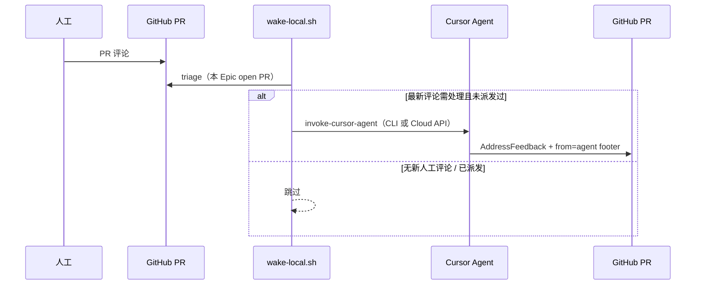

# Epic Delivery 本地唤醒与自动处理

> 编排 Agent **非常驻**。PR 有人工评论后，由 `wake-local.sh` Triage；加 `--auto` 时**自动调用 Cursor Agent** 进入阶段 6。
> **只跟踪当前 Epic** 的子 Issue / PR / Discussion。

## 流程



## 前置：API Key

1. 在 [Cursor Dashboard → Integrations](https://cursor.com/dashboard/integrations) 创建 **User API Key**
2. 写入本地 env（**不要提交**）：

```bash
cp scripts/epic/epic-wake.env.example scripts/epic/epic-wake.env
# 编辑 epic-wake.env，填入 CURSOR_API_KEY=cursor_...
```

`run-wake-cron-2595.sh` 启动时会 `source scripts/epic/epic-wake.env`。

## 用法

```bash
REPO=alibaba/loongcollector
EPIC=2595
DISCUSSION=1928

# 仅 Triage + 打印提示词
scripts/epic/wake-local.sh --repo "$REPO" --epic "$EPIC" --discussion "$DISCUSSION"

# 自动调用 Cursor 处理（推荐 cron 使用）
scripts/epic/wake-local.sh --repo "$REPO" --epic "$EPIC" --discussion "$DISCUSSION" --auto

# 单 PR
scripts/epic/wake-local.sh --repo "$REPO" --epic "$EPIC" --pr 2619 --auto
```

## 定时任务

已安装示例（Epic #2595）：

```bash
*/15 * * * * /apsara/workspace/loongcollector/scripts/epic/run-wake-cron-2595.sh
```

日志：`/tmp/epic-2595-wake.log`  
去重状态：`/tmp/epic-wake-state/epic-2595-dispatched.tsv`（同一 comment id 只派发一次）

## 调用链

| 脚本 | 作用 |
|------|------|
| `run-wake-cron-2595.sh` | cron 入口，加载 env，`wake-local --auto` |
| `wake-local.sh` | Triage + 可选 `--auto` 派发 |
| `triage-pr-feedback.sh` | 识别 Agent / 人工评论 |
| `invoke-cursor-agent.sh` | 本地 `agent -p` 或 `POST /v1/agents`（`workOnCurrentBranch` + `prUrl`） |

本地 `agent` CLI 不可用时（如 glibc 过旧）自动 **fallback 到 Cloud Agents API**。

## Triage 规则

见 `comment-convention.md`：**Agent 须带 `from=agent` footer**；无标识 = 人工意见。  
`--auto` 仅看各 PR **最新一条**评论，避免历史评论重复唤醒。

## 并行派发与依赖

Discussion「A1–A2 ∥ B1–B2」≠ 忽略 `Blocked by`。例：**B2 须等 B1** 后再派执行 Agent。详见 `orchestration-model.md`。

## 子 skill 路径（测试期）

Epic skill 在 `.skill/skills/epic-delivery/`；合入主干前，compile 等子 skill 仍从 **`.claude/skills/`** 加载（见 invoke 提示词）。
