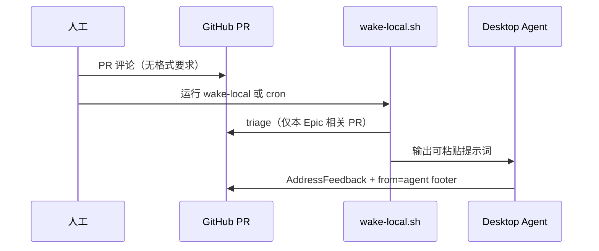

# Epic Delivery 本地唤醒

> 编排 Agent **非常驻**。PR 有人工评论后，用本机脚本 Triage，再开一轮 **Desktop Agent** 会话处理。
> 执行 skill 时**只跟踪当前 Epic 及其子 Issue / PR / Discussion**，不扫全仓。

## 流程



## 用法

编排 Agent 或人工在**本轮 Epic 上下文**下执行（替换占位符）：

```bash
REPO=<owner>/<repo>
EPIC=<epic_number>          # 如 2595
DISCUSSION=<discussion_n>   # 如 1928，可选，写入提示词

# 单 PR（PR 评论后）
scripts/epic/wake-local.sh --repo "$REPO" --epic "$EPIC" --pr <pr_number>

# 扫 Epic 下所有子 Issue 关联的 open PR
scripts/epic/wake-local.sh --repo "$REPO" --epic "$EPIC"

# 定时（可选）
*/15 * * * * cd <repo_root> && scripts/epic/wake-local.sh --repo "$REPO" --epic "$EPIC"
```

有 `ACTION REQUIRED` 时，将脚本输出的提示词粘贴到 Cursor Desktop Agent。

## Triage 范围

| 命令 | 跟踪范围 |
|------|----------|
| `--pr N` | 仅 PR #N（配合 `--latest-only` 看最新评论） |
| `--epic N` | Epic #N 子 Issue 列表 → 各 Issue 的 open PR（`Closes #` / 分支名） |

评论规则见 `comment-convention.md`：**Agent 带 `from=agent` 标识**；无标识视为人工意见。

## 编排 Agent 唤醒后清单

```bash
REPO=<owner>/<repo>
EPIC=<epic_number>

gh issue view $EPIC --repo $REPO --json title,body,subIssuesSummary
bash scripts/epic/triage-pr-feedback.sh --repo $REPO --epic $EPIC

# 对 ACTION REQUIRED 的 PR：
PR=<number>
bash scripts/epic/triage-pr-feedback.sh --repo $REPO --pr $PR --latest-only
gh pr view $PR --repo $REPO --json reviews,comments,statusCheckRollup
gh pr checks $PR --repo $REPO
```

路由：有人工新评论 → 阶段 6 AddressFeedback；仅 Agent `action=none` → 退出。

## 并行派发与依赖（编排必读）

Discussion 阶段表里的「A1–A2 ∥ B1–B2」表示**阶段内可同批规划**，**不等于**忽略子 Issue 上的 `Blocked by`。

派发前对每个 `agent-ready` 子 Issue：

1. 读 `Blocked by` 字段；
2. **阻塞项未完成**（blocker 无 merged PR / 未 ReadyToMerge）→ **不得**派该 Issue 的执行 Agent；
3. 例：**B2 `Blocked by: B1`** → B1 至少 draft PR 合入或 B1 产物可用后再派 B2。

「并行不等反馈」仅指：已派发的**互不依赖**项之间不因 review 互相阻塞；**不**覆盖依赖边。
