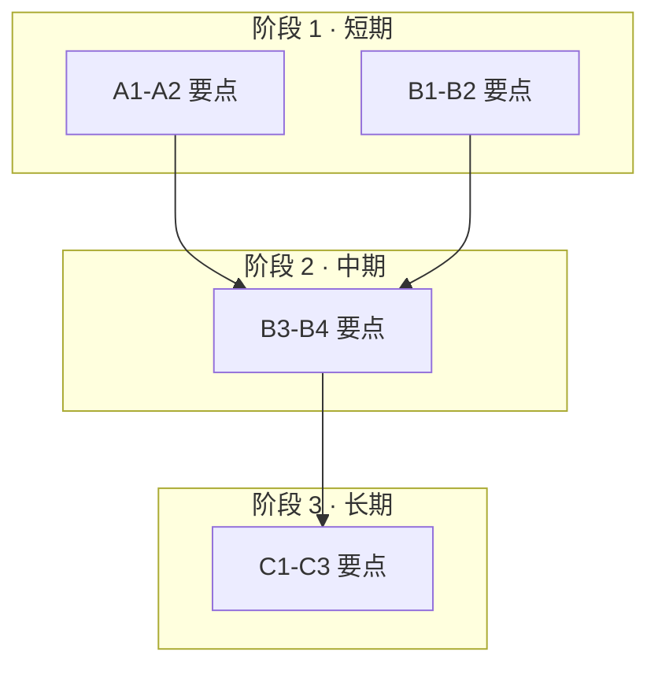

# 目标 Discussion 模板

> 用途：撰写"描述一个大型目标"的 Discussion。复制以下骨架，替换占位符。
> 配套 skill：`.skill/skills/design-document`、`.skill/skills/mermaid`、`.skill/skills/project-knowledge`。
> 原则：只写架构总纲与里程碑，不放代码；每个工作项必须带**代码锚点**与**验收方式**。

---

## 总览

一句话目标。整体推进顺序（如 `A → B → C`，支线 `D` 与 B/C 交叉）。

| 线 | 终态目标 |
|----|----------|
| A. <名称> | <终态描述> |
| B. <名称> | <终态描述> |
| C. <名称> | <终态描述> |
| D. <名称>（支线） | <终态描述> |

## 分阶段依赖

| 阶段 | 步骤 | 依赖 | 备注 |
|------|------|------|------|
| 1 | A1-A2 ∥ B1-B2 | 无 | <约束> |
| 2 | B3-B4，A3 | 阶段 1 | <约束> |
| 3 | C1-C3 | 阶段 2 | <最后才做的硬约束> |

## 各线工作项

### 线 A：<名称>

- **现状（代码锚点）**：`path/to/File.cpp` 的 `SomeFunc`（约 L123）……
- **目标**：……
- **分阶段**：

| 步骤 | 工作项 | 涉及代码 / 验收 | 依赖 |
|------|--------|-----------------|------|
| A1 | <做什么> | `path`；UT：`XxxUnittest` | — |
| A2 | <做什么> | `path`；E2E：`<case>` | A1 |

- **风险与约束**：……

（线 B / C / D 重复上述结构）

## 风险与约束

- <跨线风险、兼容性约束、必须最后做的步骤……>

## 里程碑 / Progress

> 进度的事实来源是 Epic Issue 的 checklist；此表按里程碑手动同步快照即可。

| 步骤 | Issue | PR | 状态 |
|------|-------|----|------|
| A1 | #— | #— | 未开始 |
| B1 | #— | #— | 未开始 |
