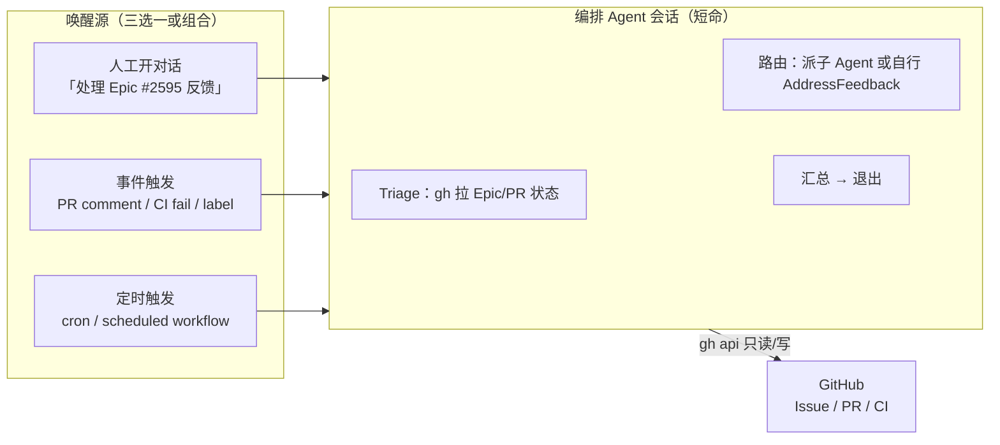
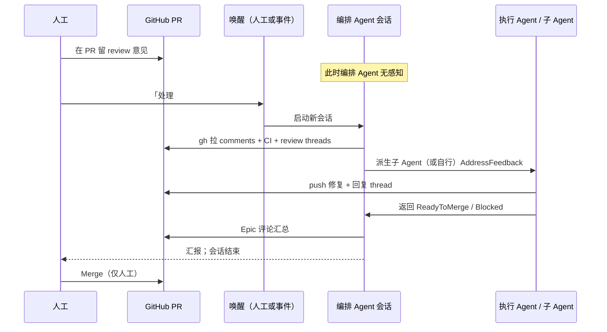

# 编排 Agent 感知与调度模型

> 回答：**你在 PR 里评论后，编排 Agent 如何知道？是否需要常驻进程？**

## 结论（先看这个）

| 问题 | 答案 |
|------|------|
| 编排 Agent 会自己「听到」评论吗？ | **不会**。会话结束后 Agent 不存在，没有后台监听。 |
| 需要常驻进程吗？ | **默认不需要**。用「事件唤醒」或「人工唤醒 + 拉取」即可。 |
| 什么时候才需要常驻/定时任务？ | 只有在你**既不想手动开对话、又不配置任何外部触发器**时，才用 cron/守护进程轮询 GitHub。 |

推荐模型：**无常驻进程 + 按需唤醒 + 唤醒后 `gh` 拉取状态**（见下）。

---

## 架构：三种唤醒方式



### 1. 人工唤醒（基线，零基础设施）

你在 IDE/对话里发一句，例如：

- `按 epic-delivery 处理 #2595 的 PR 反馈`
- `babysit #2618`

编排 Agent **在本轮会话内**用 `gh` 拉取最新评论/CI，进入阶段 6（AddressFeedback），处理完**退出**。  
**不需要**编排 Agent 常驻；需要的是**你（或同事）在需要时开一轮对话**。

### 2. 事件唤醒（推荐自动化方向）

由**外部系统**在事件发生时**启动一轮新的 Agent 会话**。

**Cursor 版（本仓库推荐）**：PR `COMMENTED` → Cursor Automation → Cloud Agent 跑 Triage + AddressFeedback。配置见 **`references/cursor-automation-setup.md`**，草稿见 **`references/cursor-automation-draft.yaml`**。

| 事件 | 典型做法 |
|------|----------|
| PR 收到 review comment | **Cursor Automation**（PR comment）或仓库 Workflow / Webhook |
| CI failed | Workflow `workflow_run` / `check_suite` → 同上 |
| 人工打 label `agent-process-feedback` | Workflow `issues`/`pull_request` labeled → 唤醒 |

评论须带 **`references/comment-convention.md`** 标识：**仅 Agent 必打** `from=agent` footer；**人工评论无格式要求**，无标识即视为待处理意见。

编排 Agent 仍**不常驻**；是「每个事件 = 一次短命会话」。

> 具体触发器绑定 IDE/CI 产品，不写入 SKILL 正文细节；在仓库 `.github/workflows/` 或运维侧配置，需 `workflow` token 或 GitHub App。

### 3. 定时轮询（可选，非默认）

例如 cron 每 15 分钟跑脚本：

```bash
# 示例：列出 Epic 下 open 且有待处理信号的 PR（需自行扩展筛选）
gh pr list --repo <owner>/<repo> --search "head:feat/1928-" --json number,reviewDecision,statusCheckRollup
```

只有在你**无法**用事件唤醒、又希望少手动开对话时再用。**仍不必**让 Agent 进程 7×24 挂着——只需 cron 触发**新会话**。

---

## 人工评论后：推荐流程



要点：

- **评论 ≠ 自动唤醒**；必须有一次「唤醒」动作。
- **一个 PR 的意见处理**可派**一个子 Agent**（与开发子 Agent 同模型），编排 Agent 只做 triage 与汇总。
- 处理完再次**停止**，不等下一条评论（下一条评论需要再次唤醒）。

---

## 编排 Agent 唤醒后的 Triage 清单

每次被唤醒，编排 Agent **必须先拉事实再动作**：

```bash
REPO=<owner>/<repo>
EPIC=<epic_number>

# 1. Epic 总览
gh issue view $EPIC --repo $REPO --json title,subIssuesSummary,body

# 2. Epic 下 open PR（按分支前缀或 Epic 评论里的链接）
gh pr list --repo $REPO --search "draft:false OR draft:true" --json number,title,headRefName,isDraft,url,statusCheckRollup

# 3. 对某个待处理 PR：评论 + review threads + CI
PR=<number>
bash scripts/epic/triage-pr-feedback.sh --repo $REPO --pr $PR   # 优先：解析 action=required
gh pr view $PR --repo $REPO --json reviews,comments,statusCheckRollup,mergeable,headRefName
gh api repos/$REPO/pulls/$PR/comments --jq '.[] | {user:.user.login, path, line, body}'
gh pr checks $PR --repo $REPO

# 4. 是否有人工新评论（对比上次处理时间 — 可选，在 Epic 评论里记 last-triage SHA/时间）
```

路由规则：

| 信号 | 动作 |
|------|------|
| 有 unresolved review + CI 红 | 派子 Agent：`AddressFeedback`（先 CI 或先 comment，按 skill 阶段 6） |
| 仅 CI 红、无 comment | 派子 Agent：`loop-on-ci` 等价流程 |
| 仅有 comment、CI 绿 | 派子 Agent：处理 comment → ReadyToMerge |
| 已 ReadyToMerge、无新 comment | **不动**，@人工 Merge |
| 需架构决策 | 打 `needs-human`，停止 |

---

## 与「并行 batch 不等反馈」的关系

| 阶段 | 是否等人工 | 说明 |
|------|------------|------|
| 派发并行开发（A1∥A2∥B1∥B2） | **不等** | 派子 Agent 后汇总 draft PR 链接即可 |
| PR 在 review 中 | **不等**（默认） | 无唤醒则不处理；有评论时需**一次唤醒** |
| ReadyToMerge | **等 Merge** | 仅 Merge 必须人工 |

「不等反馈」指：**不要因为 batch 里一个 PR 被 comment 就阻塞其它并行 Issue 的开发**；  
**不是**指 Agent 会自动处理 comment（那仍需唤醒）。

---

## 状态持久化：GitHub 即消息队列

Agent 无内存时，以 GitHub 为事实来源：

| 存什么 | 放哪 |
|--------|------|
| 总进度 | Epic Issue checklist + Sub-issues |
| 某步 PR 链接 | 子 Issue 评论 |
| 上次 triage 时间 / 处理到的 comment id | Epic 评论（人工可读）或 `docs/epic/<epic>-status.md`（可选） |
| 阻塞 | Issue label `needs-human` |

不建议依赖「编排 Agent 记得上次说到哪」。

---

## 可选：仓库内最小自动化（示意）

若希望**评论后少手动开对话**，可在仓库增加 label 驱动（需维护者配置 Workflow 与 secrets）：

1. 人工在 PR 评论后打 label：`agent-process-feedback`
2. Workflow 触发外部 Agent 或通知
3. Agent 会话按本文件 Triage 清单执行

无 Workflow 权限时（token 缺 `workflow` scope），继续用**人工唤醒**即可。
