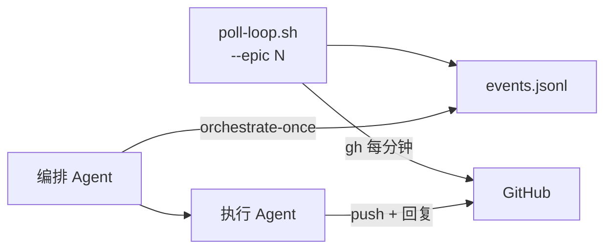

# 编排 Agent 感知与调度模型

> 编排 Agent 接管 Epic 时，用 **`--epic <Issue编号>`** 驱动 `scripts/epic/`，自动发现范围并轮询评论。

## 结论（先看这个）

| 问题 | 答案 |
|------|------|
| 脚本绑定某个 Epic 吗？ | **否**。只传 Epic Issue 号；子 Issue / PR 从 checklist 与 `Closes #` 自动发现。 |
| 编排 Agent 要常驻吗？ | **Agent 会话不常驻**；**轮询 shell 后台常驻**（`poll-loop`），由编排 Agent 启动/停止。 |
| 跟踪范围？ | **仅该 Epic** 的 Issue / 子 Issue / 关联 PR，不扫全仓。 |

推荐模型：**编排 Agent 启动 poll-loop → 周期 orchestrate-once → 派执行 Agent → mark-handled**。

---

## 架构



---

## 编排 Agent 必执行流程

### 1. 接管 Epic：启动轮询

```bash
./scripts/epic/poll-start.sh --epic <EPIC_NUMBER> [--repo owner/repo]
```

- 首次启动会对当前评论做 **baseline**（`seen-ids.txt`），之后只报**新增**可处理评论。
- 状态目录：`/tmp/epic-<EPIC>-poll/`（与 Epic 号一一对应，可并存多个 Epic）。

### 2. 每轮工作：Triage + 派发

```bash
./scripts/epic/orchestrate-once.sh --epic <EPIC_NUMBER>
```

输出 `DISPATCH PR #…` / `DISPATCH issue #…` 时，派**执行 Agent**（单 Issue / 单 PR）进入 AddressFeedback。

派子 Agent 前仍须读 **`Blocked by`**（B2 不得与 B1 并行派发开发，见下节）。

### 3. 处理完毕：标记已消费

```bash
./scripts/epic/events.sh --epic <EPIC_NUMBER> mark-handled <comment_id>
```

处理人工 PR 意见时，**在该评论下回复**（禁止另开顶层汇总评）：

```bash
./scripts/epic/gh-reply.sh --repo <owner>/<repo> --pr <pr> --comment-id <id> --body-file reply.md
```

- Review 行评：`pulls/{pr}/comments/{id}/replies`（真 thread）
- Conversation 评论：API 不支持 thread 时用 **Quote reply**（`gh-reply.sh` 自动引用原文）

### 4. Epic 结束：停止轮询

```bash
./scripts/epic/poll-stop.sh --epic <EPIC_NUMBER>
```

### 辅助命令

```bash
./scripts/epic/scan-scope.sh --epic <EPIC_NUMBER>     # 查看扫描范围
./scripts/epic/events.sh --epic <EPIC_NUMBER> list    # pending 事件 JSON
./scripts/epic/poll-once.sh --epic <EPIC_NUMBER>      # 手动单次扫描
tail -f /tmp/epic-<EPIC>-poll/poll.log                # 轮询日志
```

可选默认：`scripts/epic/epic.env`（仅 `REPO`、`INTERVAL`，**不含 Epic 号**）。

---

## 并行派发 vs 依赖边（重要）

Discussion 阶段表常写「A1–A2 ∥ B1–B2」，表示**同一阶段可同批规划**，**不等于**所有子 Issue 可同时开干。

**派发前必须读子 Issue 的 `Blocked by`：**

| 子 Issue | Blocked by | 能否与 blocker 并行派 Agent？ |
|----------|------------|------------------------------|
| B1 | — | 可以 |
| B2 | B1 | **否** — B1 至少 ReadyToMerge / 合入后再派 B2 |
| A1 / A2 | —（阶段 1） | 可以 |

「并行不等反馈」指：**已派发且互不依赖**的 Issue 之间，不因某个 PR 被 comment 就阻塞其它 PR 的开发；**不**表示可以跳过 `Blocked by`。

---

## 评论事件路由

| 信号 | 动作 |
|------|------|
| 新增人工评论（无 `from=agent`） | AddressFeedback |
| Agent 评论 `action=required` | AddressFeedback |
| Agent 评论 `action=none/fyi` | 跳过（仅信息） |
| 仅 CI 红、无新 comment | 修 CI（本 PR 范围） |
| ReadyToMerge、无新 comment | 不动，@人工 Merge |
| 需架构决策 | `needs-human` |

评论标识：`comment-convention.md`。

---

## 手动 gh Triage（补充）

轮询未覆盖或需深挖 CI 时，编排 Agent 仍可直接：

```bash
REPO=<owner>/<repo>
EPIC=<epic_number>

gh issue view $EPIC --repo $REPO --json title,body,subIssuesSummary

PR=<number>
gh pr view $PR --repo $REPO --json reviews,comments,statusCheckRollup,headRefName
gh api repos/$REPO/pulls/$PR/comments --jq '.[] | {user:.user.login, path, line, body}'
gh pr checks $PR --repo $REPO
```

---

## 与 batch 不等反馈的关系

| 阶段 | 是否等人工 | 说明 |
|------|------------|------|
| 派发**无依赖**的并行步骤 | **不等** | 派子 Agent 后汇总 draft PR |
| 有 `Blocked by` 的步骤 | **等 blocker** | 不得与 blocker 并行派发 |
| ReadyToMerge | **等 Merge** | 仅 Merge 必须人工 |

---

## 状态持久化

| 存什么 | 放哪 |
|--------|------|
| 总进度 | Epic checklist + Sub-issues |
| PR 链接 | 子 Issue 评论 |
| 阻塞 | `needs-human` label |
| 轮询 baseline / 事件 | `/tmp/epic-<EPIC>-poll/` |

不建议依赖编排 Agent 会话内存。
