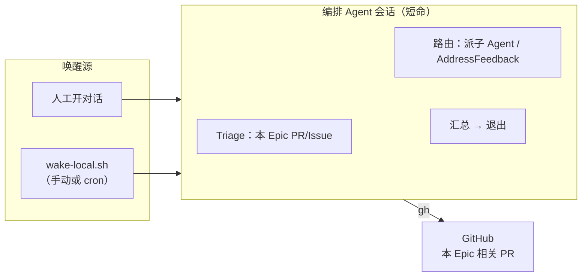
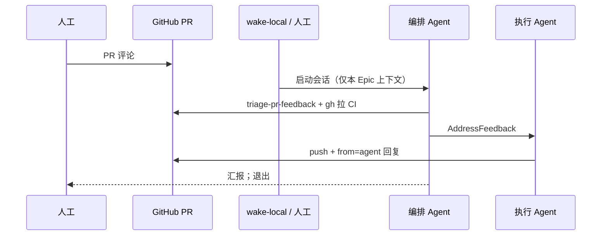

# 编排 Agent 感知与调度模型

> 回答：**你在 PR 里评论后，编排 Agent 如何知道？是否需要常驻进程？**

## 结论（先看这个）

| 问题 | 答案 |
|------|------|
| 编排 Agent 会自己「听到」评论吗？ | **不会**。会话结束后 Agent 不存在，没有后台监听。 |
| 需要常驻进程吗？ | **不需要**。本地 `wake-local.sh` + Desktop Agent，或人工开对话。 |
| 跟踪范围？ | **仅当前 Epic 的子 Issue / PR / Discussion**，不扫全仓。 |

推荐模型：**无常驻 + 本地唤醒 + `gh` 拉取本 Epic 状态**。

---

## 架构：唤醒方式



### 1. 人工唤醒

- `按 epic-delivery 处理 Epic #<epic> / PR #<pr> 的评论`
- 编排 Agent 用 `gh` 拉取**该 Epic 范围内**的评论/CI，处理完退出。

### 2. 本地脚本唤醒

见 **`references/cursor-automation-setup.md`**：

```bash
scripts/epic/wake-local.sh --repo <owner>/<repo> --epic <EPIC> [--pr <PR>]
```

### 3. 定时轮询（可选）

cron 定期跑 `wake-local.sh --epic <EPIC>`；有 pending 时粘贴提示词到 Desktop Agent。

---

## 并行派发 vs 依赖边（重要）

Discussion 阶段表常写「A1–A2 ∥ B1–B2」，表示**同一阶段可同批规划**，**不等于**所有子 Issue 可同时开干。

**派发前必须读子 Issue 的 `Blocked by`：**

| 子 Issue | Blocked by | 能否与 blocker 并行派 Agent？ |
|----------|------------|------------------------------|
| B1 | — | 可以 |
| B2 | B1 | **否** — B1 至少 ReadyToMerge / 合入后再派 B2 |
| A1 / A2 | —（阶段 1） | 可以 |

**#1928 实际偏差**：编排 Agent 把 B2 与 B1 同批并行派发，**忽略了 #2599 上的 `Blocked by: B1`** 以及 Discussion 明细表中 B2 依赖 B1。B2 的矩阵盘点虽多为只读，但按 Epic 契约应等 B1 透传 helper 就绪后再做，避免重复口径、返工。

「并行不等反馈」指：**已派发且互不依赖**的 Issue 之间，不因某个 PR 被 comment 就阻塞其它 PR 的开发；**不**表示可以跳过 `Blocked by`。

---

## 人工评论后：推荐流程



---

## Triage 清单（仅本 Epic）

```bash
REPO=<owner>/<repo>
EPIC=<epic_number>

gh issue view $EPIC --repo $REPO --json title,body,subIssuesSummary
bash scripts/epic/triage-pr-feedback.sh --repo $REPO --epic $EPIC

PR=<number>
bash scripts/epic/triage-pr-feedback.sh --repo $REPO --pr $PR --latest-only
gh pr view $PR --repo $REPO --json reviews,comments,statusCheckRollup
gh pr checks $PR --repo $REPO
```

路由规则：

| 信号 | 动作 |
|------|------|
| 人工新评论 / CI 红 + comment | AddressFeedback |
| 仅 CI 红 | 修 CI（本 PR 范围） |
| ReadyToMerge、无新 comment | 不动，@人工 Merge |
| 需架构决策 | `needs-human` |

评论标识：`comment-convention.md`（仅 Agent 必打 footer）。

---

## 与 batch 不等反馈的关系

| 阶段 | 是否等人工 | 说明 |
|------|------------|------|
| 派发**无依赖**的并行步骤 | **不等** | 派子 Agent 后汇总 draft PR |
| 有 `Blocked by` 的步骤 | **等 blocker** | 不得与 blocker 并行派发 |
| PR review 中 | 无唤醒则不处理 | comment 需一次唤醒 |
| ReadyToMerge | **等 Merge** | 仅 Merge 必须人工 |

---

## 状态持久化

| 存什么 | 放哪 |
|--------|------|
| 总进度 | Epic checklist + Sub-issues |
| PR 链接 | 子 Issue 评论 |
| 阻塞 | `needs-human` label |

不建议依赖编排 Agent 会话内存。
