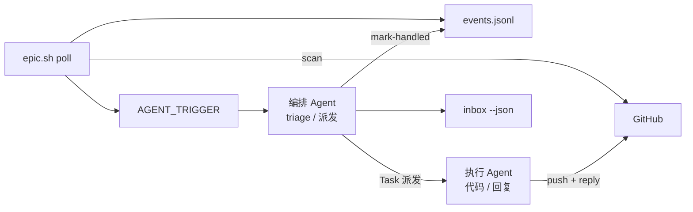

# 编排 Agent 感知与调度模型

> 编排 Agent 接管 Epic 时，用 **`--epic <Issue编号>`** 驱动 `scripts/epic/`，自动发现范围并轮询评论。

## 结论（先看这个）

| 问题 | 答案 |
|------|------|
| 脚本绑定某个 Epic 吗？ | **否**。只传 Epic Issue 号；子 Issue / PR 从 checklist 与 `Closes #` 自动发现。 |
| 编排 Agent 要常驻吗？ | **轮询 `poll-loop` 在编排 Agent 终端前台运行**，与会话同生死（会话关→轮询停），不留孤儿进程。 |
| 跟踪范围？ | **仅该 Epic** 的 Issue / 子 Issue / 关联 PR，不扫全仓。 |

推荐模型：**`poll` → `AGENT_TRIGGER` → 编排 Agent `inbox` → 派执行 Agent（代码/回复）→ 编排 Agent `mark-handled`**。



---

## 编排 vs 执行（必遵 · 勿阻塞编排 Agent）

| 角色 | 做什么 | **禁止** |
|------|--------|----------|
| **编排 Agent** | 跑 poll、读 `inbox --json`、读 `Blocked by`、**派执行 Agent**、汇总 Epic 进度、`mark-handled`、并行派发无依赖 Issue | **亲自**改代码、checkout 分支、长时构建/单测、大段读 diff、在 AddressFeedback 里写 commit |
| **执行 Agent** | 单 Issue/单 PR 全闭环：读评论 → 改代码 → 验收 → `reply --body-file` → 回报 PR URL / 是否 ReadyToMerge | 兼做编排；一个会话做多 Issue |

**原则**：编排 Agent 收到 `AGENT_TRIGGER` 后**只做 triage + 派发**，随即回到 poll/其他并行调度；**代码相关改动一律 Task 派子 Agent**（可 `run_in_background: true`），子 Agent 完成后再由编排 Agent `mark-handled`（或子 Agent 回报 comment_id 后编排代 mark）。

纯文字回复（无需改代码、已核查完毕）时，编排 Agent 可**仅** `reply --body-file` + `mark-handled`，但仍应简短，勿在长链路上阻塞。

**派发模板**（每条 inbox 事件一条 Task；**必须复制 `inbox --json` 的 `dispatch_prompt` 全文**，见 `references/executor-dispatch-template.md`）：

```bash
./scripts/epic/epic.sh inbox --epic <N> --json   # pending → dispatch_prompt
./scripts/epic/epic.sh dispatch-prompt --epic <N> [comment_id]   # 单条 pending
./scripts/epic/epic.sh dispatch-prompt --epic <N> --issue <M>   # 新 Issue Develop
```

编排 Agent：**禁止**手写精简 Task；子 Agent 无会话记忆，缺 Skills/范围锁/维护者原文会导致实现偏离。

---

## 编排 Agent 必执行流程

### 1. 启动 poll + 监听 AGENT_TRIGGER（推荐）

**终端 A**（前台 poll，与会话同生死）：

```bash
./scripts/epic/epic.sh poll --epic <EPIC_NUMBER>
```

**编排 Agent 会话**（Cursor 等）：对 poll 终端 stdout 配置 `notify_on_output`，匹配：

```text
^AGENT_TRIGGER_EPIC<EPIC_NUMBER>
```

收到 wake 后**立即**（编排 Agent **不**在此步改代码）：

```bash
./scripts/epic/epic.sh inbox --epic <EPIC_NUMBER> --json
```

对每条事件：**复制 JSON 中的 `dispatch_prompt` 整段** 派 Task 执行 Agent（见 `executor-dispatch-template.md`）。**禁止**自行缩写为「处理 PR 评论」。

```bash
./scripts/epic/epic.sh events --epic <N> mark-handled <comment_id>
```

**无 poll 终端时**（Agent 自驱轮询）：

```bash
./scripts/epic/epic.sh inbox --epic <N> --wait 60 --json
# 内部 poll-once + 阻塞直到有 pending
```

### 2. poll 行为摘要

| 配置 | 默认 | 说明 |
|------|------|------|
| `AGENT_NOTIFY` | true | 有 pending 时打印 `AGENT_TRIGGER_EPIC<N> {json}` |
| `AUTO_DISPATCH` | false | true 时额外跑 bash `dispatch` hook |
| `DISPATCH_RETRY_PENDING` | true | pending 时每轮继续 notify（避免漏 wake） |

- 单实例守卫、SCOPE_TTL 缓存等同前。
- `--no-auto-dispatch` 关闭 bash hook；`AGENT_NOTIFY=false` 关闭 Agent 唤醒行。

### 3. 手动 triage / dispatch / inbox

```bash
./scripts/epic/epic.sh triage --epic <N>
./scripts/epic/epic.sh dispatch --epic <N>   # bash hook（AUTO_DISPATCH=true 时 poll 自动调）
./scripts/epic/epic.sh inbox --epic <N> --json
```

### 4. 处理完毕 + 停止 poll

处理人工 PR 意见时，**在该评论下回复**（禁止另开顶层汇总评）：

```bash
./scripts/epic/epic.sh reply --pr <pr> --comment-id <id> --body-file reply.md
```

- Review 行评：`pulls/{pr}/comments/{id}/replies`（真 thread）
- Conversation 评论：API 不支持 thread 时自动 **Quote reply**（引用原文）

```bash
./scripts/epic/epic.sh events --epic <EPIC_NUMBER> mark-handled <comment_id>
```

### 5. Epic 结束：停止轮询

前台 `Ctrl-C`；或从另一终端：

```bash
./scripts/epic/epic.sh stop --epic <EPIC_NUMBER>
```

### 辅助命令

```bash
./scripts/epic/epic.sh label-sync --epic <EPIC>   # OPEN+PR → in-progress；CLOSED → 去掉 agent-ready/in-progress
./scripts/epic/epic.sh scope     --epic <EPIC_NUMBER>   # 查看扫描范围
./scripts/epic/epic.sh events    --epic <EPIC_NUMBER> list   # pending 事件 JSON
./scripts/epic/epic.sh poll-once --epic <EPIC_NUMBER>   # 手动单次扫描（--init 仅建基线）
tail -f /tmp/epic-<EPIC>-poll/poll.log                  # 轮询日志
```

可选默认：`scripts/epic/epic.env`（仅 `REPO`、`INTERVAL`，**不含 Epic 号**）。

---

## 并行派发 vs 依赖边（重要）

Discussion 阶段表常写「A1–A2 ∥ B1–B2」，表示**同一阶段可同批规划**，**不等于**所有子 Issue 可同时开干。

**派发前必须读子 Issue 的 `Blocked by`：**

| 子 Issue | Blocked by | 能否与 blocker 并行派 Agent？ |
|----------|------------|------------------------------|
| B1 | — | 可以 |
| B2 | B1 | **否** — B1 至少 ReadyToMerge / 合入后再派 B2 |
| A1 / A2 | —（阶段 1） | 可以 |

「并行不等反馈」指：**已派发且互不依赖**的 Issue 之间，不因某个 PR 被 comment 就阻塞其它 PR 的开发；**不**表示可以跳过 `Blocked by`。

---

## 评论事件路由

| 信号 | 动作 |
|------|------|
| 新增人工评论（无 `from=agent`） | AddressFeedback |
| Agent 评论 `action=required` | AddressFeedback |
| Agent 评论 `action=none/fyi` | 跳过（仅信息） |
| **PR 合并**（`pr_state` → MERGED） | **merge-followup 全流程**（见下节）→ 对 `unlocked[]` **立即 Task 派执行 Agent** |
| **PR 关闭**（`pr_state` → CLOSED） | 确认是否需重开 / 调整 Epic 计划 |
| 仅 CI 红、无新 comment | 修 CI（本 PR 范围） |
| ReadyToMerge、无新 comment | 不动，@人工 Merge |
| 需架构决策 | `needs-human` |

评论标识：`comment-convention.md`。

---

## PR merge → 解锁、更新、开工、派工（必遵）

收到 `pr_state` **MERGED** 时，编排 Agent **不得**只发 unlock 评论就结束；须在同一轮完成：

```bash
./scripts/epic/epic.sh merge-followup --epic <EPIC> --pr <PR> --json
./scripts/epic/epic.sh events --epic <EPIC> mark-handled prstate-<PR>-MERGED
```

`merge-followup` 自动完成：

| 步骤 | 动作 |
|------|------|
| 1 | Epic checklist 勾选 `Closes #` 对应子 Issue |
| 2 | **立即释放资源**（见下表 `cleanup`） |
| 3 | 扫描 Epic 子 Issue：匹配 `Blocked by` 且依赖已满足 → 更新/解锁 |
| 4 | 在后续 Issue **评论**前置交付摘要；打 `in-progress` label |
| 5 | stdout JSON 的 `unlocked[].dispatch_prompt` → **每条 Task 派执行 Agent**（与 `dispatch-prompt --issue` 同款） |

**步骤 2 · merge 后资源清理（必遵，不可拖延）**

| 资源 | 动作 |
|------|------|
| **worktree** | 按 `wt-{id}-*` 与 PR `headRefName` 定位；`git clean -fd` 后 `worktree remove`（必要时 `--force`）；`git worktree prune` |
| **本地分支** | 删除 PR head 与 `feat/{id}-*` 本地分支 |
| **远端分支** | 尝试删除 fork（`origin`）与主仓（`upstream`）上已 merge 的特性分支 |
| **Issue label** | 移除已关闭子 Issue 的 `in-progress`、`agent-ready` |
| **构建/临时文件** | worktree 内 `.tmp/` 等由 `git clean` 一并清掉 |

`merge-followup --json` 输出 `cleanup` 字段供编排 Agent 核对；若有 `errors` 需在本轮处理或打 `needs-human`。

手动清理：`./scripts/epic/epic.sh wt rm --id <1928-a2>`（含 force remove + 双远端删分支）。

编排 Agent 收到 `merge-followup` 输出后**立即并行派发**所有 `unlocked` 项，不要等人工确认。

**禁止**：仅发 `unlock-notify` 评论而不派工；编排 Agent 自己的 `action=start-dispatch` / `action=unlock-notify` 评论会被 poll **跳过**（非 AddressFeedback）。

---

轮询未覆盖或需深挖 CI 时，编排 Agent 仍可直接：

```bash
REPO=<owner>/<repo>
EPIC=<epic_number>

gh issue view $EPIC --repo $REPO --json title,body,subIssuesSummary

PR=<number>
gh pr view $PR --repo $REPO --json reviews,comments,statusCheckRollup,headRefName
gh api repos/$REPO/pulls/$PR/comments --jq '.[] | {user:.user.login, path, line, body}'
gh pr checks $PR --repo $REPO
```

---

## 与 batch 不等反馈的关系

| 阶段 | 是否等人工 | 说明 |
|------|------------|------|
| 派发**无依赖**的并行步骤 | **不等** | 派子 Agent 后汇总 draft PR |
| 有 `Blocked by` 的步骤 | **等 blocker** | 不得与 blocker 并行派发 |
| ReadyToMerge | **等 Merge** | 仅 Merge 必须人工 |

---

## 状态持久化

| 存什么 | 放哪 |
|--------|------|
| 总进度 | Epic checklist + Sub-issues |
| PR 链接 | 子 Issue 评论 |
| 阻塞 | `needs-human` label |
| 轮询 baseline / 事件 | `/tmp/epic-<EPIC>-poll/` |

不建议依赖编排 Agent 会话内存。
