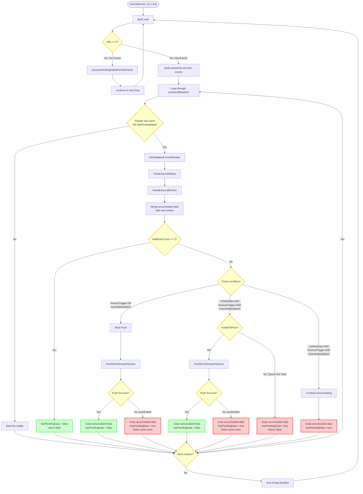

# PendingData Processing Flow with Epoll Events

## Overview
This diagram illustrates how pendingData is handled in different scenarios, combined with epoll event processing.

## Three PendingData Scenarios

### Scenario 1: pushFailed
- **When**: `PushEventGroupToQueue` fails (queue full or error)
- **Result**: 
  - `hasPendingData = true`
  - `accumulatedEventGroup` retained
  - Cursor seeked back to `firstEntryCursor`
- **Next**: Retried in next epoll cycle (with or without events)

### Scenario 2: accumulated continue
- **When**: New entries read but `totalEntryCount < maxEntriesPerBatch` and no timeout
- **Result**:
  - `hasPendingData = true`
  - `accumulatedEventGroup` contains merged data (old + new)
- **Next**: Continue accumulating in next epoll cycle

### Scenario 3: noNewData but processQueue Not valid
- **When**: `noNewData == true` but `IsValidToPush(queueKey) == false`
- **Result**:
  - `hasPendingData = true`
  - `accumulatedEventGroup` retained
- **Next**: Retried when queue becomes valid

## PendingData States

### State 1: pushFailed
- **Trigger**: `PushEventGroupToQueue` returns false (queue full or error)
- **Action**: 
  - Keep `accumulatedEventGroup` intact
  - Set `hasPendingData = true`
  - Seek cursor back to `firstEntryCursor`
- **Next Processing**: Will be retried in next epoll cycle (with or without events)

### State 2: accumulated continue
- **Trigger**: New entries read but `totalEntryCount < maxEntriesPerBatch` and no timeout
- **Action**:
  - Keep `accumulatedEventGroup` with merged data
  - Set `hasPendingData = true`
  - Continue accumulating in next cycle
- **Next Processing**: Will be processed in next epoll cycle (with or without events)

### State 3: noNewData but processQueue Not valid
- **Trigger**: `noNewData == true` but `IsValidToPush(queueKey) == false`
- **Action**:
  - Keep `accumulatedEventGroup` intact
  - Set `hasPendingData = true`
  - Return false (don't clear accumulated data)
- **Next Processing**: Will be retried in next epoll cycle when queue becomes valid

## Epoll Event Integration

### When nfds == 0 (No Events)
1. Call `processPendingDataWhenNoEvents()` to process all readers with pendingData
2. Skip readers without pendingData

### When nfds > 0 (Has Events)
1. Build `activeFDs` set from epoll events
2. Process readers that:
   - Have events in `activeFDs`, OR
   - Have `hasPendingData == true`
3. Skip readers without events and without pendingData
4. `HandleJournalEntries` merges accumulated data with new entries

## Key Points

1. **PendingData is always processed**: Whether there are epoll events or not, pendingData will be processed
2. **Merging happens in HandleJournalEntries**: When there are events, accumulated data is merged with new entries
3. **Three main pendingData scenarios**:
   - `pushFailed`: Queue push failed, data retained
   - `accumulated continue`: Still accumulating, not yet ready to push
   - `noNewData but queue invalid`: No new data but queue not available
4. **Epoll events determine which readers to process**: Only readers with events or pendingData are processed

