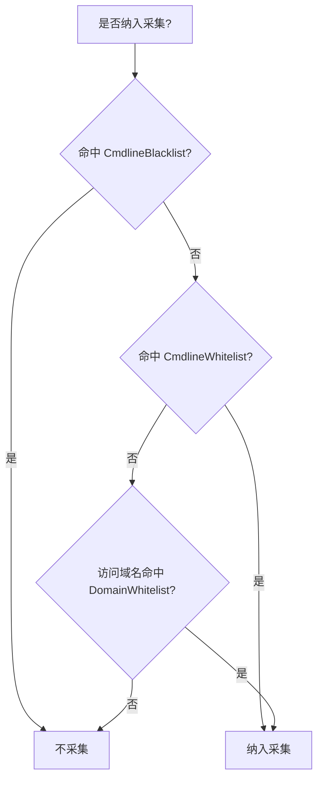

# input-agentsight 插件

## 简介

`input_agentsight` 插件实现对当前openclaw，hermes等agent工具等采集，支持的大模型供应商包括OpenAI，Anthropic，以及国内的厂商协议

## 版本

dev

## 版本说明

* 推荐版本：LoongCollector v3.1.4 及以上

## 配置参数

|  **参数**  |  **类型**  |  **是否必填**  |  **默认值**  |  **说明**  |
| --- | --- | --- | --- | --- |
|  Type  |  string  |  是  |  /  |  插件类型。固定为 `input_agentsight`  |
|  ProbeConfig  |  object  |  否  |  /  |  插件配置参数列表  |
|  ProbeConfig.Verbose  |  uint  |  否  |  /  |  是否打印ebpf的详细日志，1代表开启，0代表关闭  |
|  ProbeConfig.LogPath  |  string  |  否  |  ""  | ebpf日志的输出位置  |
|  ProbeConfig.CmdlineWhitelist  |  array  |  否  |  /  |  进程 **agent 筛选白名单**：每一项为一条规则（**字符串数组**），与进程启动参数 `argv` 按位置做 glob 匹配；**整条规则各段均匹配则视为命中**，表示该进程符合待采集的 agent 特征，可纳入采集（见下文流程图）。未配置且黑名单也为空时注入默认规则。  |
|  ProbeConfig.CmdlineBlacklist  |  array  |  否  |  /  |  进程 **agent 筛选黑名单**，规则格式同白名单；**命中则视为排除该进程**，不采集。**优先级高于白名单**：同一进程同时命中黑/白名单时，以黑名单为准。  |
|  ProbeConfig.DomainWhitelist  |  array  |  否  |  /  |  域名 **白名单**（字符串数组）：**访问白名单内域名的进程将被识别为 AI Agent 采集目标**。未配置时注入默认精确主机名列表，见下文「优先级与默认值」。  |

### 优先级与默认值

#### 黑白名单判定逻辑

进程是否纳入采集，按下列**固定顺序**判定（**不要求** `CmdlineBlacklist`、`CmdlineWhitelist`、`DomainWhitelist` 同时配置；三类名单相互独立，未配置项见下文「默认值」）：

1. 命中 `CmdlineBlacklist` → **不采集**（cmdline 黑名单优先）
2. 未命中黑名单，且命中 `CmdlineWhitelist` → **纳入采集**
3. 仍未纳入，且进程访问域名命中 `DomainWhitelist` → **纳入采集**
4. 以上均未命中 → **不采集**

同一名单内的多条规则之间为 **OR**（命中任一条即可）。



例如：只配置了 cmdline 黑名单、未配域名时，仍会注入默认 `DomainWhitelist`；只配域名、未配 cmdline 时，仍会注入默认 cmdline 白名单（当黑/白名单均为空时）。

#### Cmdline 规则优先级

1. **黑名单优先于白名单**：同一进程同时命中黑/白名单时，**黑名单生效**。
2. **多条白名单之间**：**OR**，命中任一条即可。
3. **默认注入条件**：`CmdlineWhitelist` 与 `CmdlineBlacklist` **均为空** 时，注入下表；一旦配置了 **任意一条** 用户 cmdline 白名单或黑名单，则 **不再** 注入默认 cmdline。

**默认 `CmdlineWhitelist`（9 条）**

| agent 名称 | 规则（`argv` 各段 glob） |
| --- | --- |
| Hermes | `hermes*` |
| Hermes | `*python*`, `*hermes*` |
| Hermes | `*python*`, `-m`, `*hermes*` |
| Cosh | `node*`, `*/usr/bin/co*` |
| Cosh | `node*`, `*/usr/bin/cosh*` |
| Cosh | `node*`, `*/usr/bin/copliot*` |
| Cosh | `node*`, `*copilot-shell*` |
| OpenClaw | `*openclaw-gatewa*` |
| OpenClaw | `node*`, `*openclaw*` |

#### Domain 规则优先级

1. **多条域名之间**：**OR**，命中任一条即可。
2. **默认注入条件**：`DomainWhitelist` **为空** 时，注入下表；一旦配置了 **任意一条** 用户域名，则 **不再** 注入默认域名。

**默认 `DomainWhitelist`（4 条，精确主机名）**

| 域名 |
| --- |
| `api.openai.com` |
| `api.anthropic.com` |
| `dashscope.aliyuncs.com` |
| `dashscope-intl.aliyuncs.com` |

### Cmdline 规则怎么写

配置里**每一项**是一条规则，对应 `argv` 各段（与 `/proc/<PID>/cmdline` 一致）。先在本机查看真实命令行，再写 glob：

```bash
tr '\0' ' ' < /proc/<PID>/cmdline; echo
```

每一段用 **glob** 匹配，不关心的位置写 `"*"`。示例：

```yaml
CmdlineWhitelist:
  - ["node*", "*openclaw*"]   # 见 /proc/<PID>/cmdline 后调整各段
```

### Domain 规则怎么写

`DomainWhitelist` 里每一项用于匹配进程访问的大模型 API 主机名。**默认注入为精确主机名**；自行配置时也可写 glob（如 `*.anthropic.com`），通配符为 `*`，匹配 **不区分大小写**。示例：

```yaml
DomainWhitelist:
  - "api.openai.com"
  - "dashscope.aliyuncs.com"
```

> **建议**：尽量用 `CmdlineWhitelist` / `CmdlineBlacklist` **准确描述**待采集 agent 的命令行（先在本机查看 `/proc/<PID>/cmdline` 再写 glob），缩小采集范围、减少无关进程数据。`DomainWhitelist` 只能判断进程是否访问过大模型 API，**无法区分**具体是哪一个 agent；若 cmdline 规则过宽或未配置，凡访问默认域名（OpenAI、DashScope、Anthropic 等）的进程仍可能被纳入采集。

## 输出格式

| 字段 | 类型 | 说明 |
| :--- | :--- | :--- |
| `gen_ai.session.id` | string | 用户的会话 id |
| `gen_ai.turn.id` | string | 同一会话中其中一次对话的 id |
| `gen_ai.response.id` | string | 一次对话中其中一次对大模型请求的回复 id |
| `pid` | string | 进程号（十进制字符串） |
| `comm` | string | 进程名称 |
| `gen_ai.agent.name` | string | agent 名称 |
| `gen_ai.request.timestamp` | string | 一次对大模型请求开始的时间，毫秒时间戳（十进制字符串） |
| `gen_ai.response.duration` | string | 一次对大模型请求到大模型回复的耗时，毫秒（十进制字符串） |
| `server.address` | string | 从请求 URL 解析出的服务端主机名（有请求 URL 时输出） |
| `server.port` | string | 从请求 URL 解析出的端口（URL 中含显式端口时输出） |
| `gen_ai.provider.name` | string | 大模型厂商名称 |
| `gen_ai.request.model` | string | 大模型厂商使用的模型名称 |
| `status_code` | string | 一次请求的状态码，同 HTTP 状态码（十进制字符串，如 `200`） |
| `is_sse` | string | 是否为 SSE（Server-Sent Events）连接；日志中取值为 `1`（是）或 `0`（否） |
| `gen_ai.response.finish_reasons` | string | 大模型停止产生 token 的原因 |
| `is_usage_from_api` | string | 数据来源标识，true 表示来自 LLM API response usage 字段（精确值），false 表示由插件本地估算（近似值） |
| `gen_ai.usage.input_tokens` | string | 发送给模型的 token 数量（十进制字符串） |
| `gen_ai.usage.output_tokens` | string | 模型实际生成的回复内容长度（十进制字符串） |
| `gen_ai.usage.total_tokens` | string | 一次请求消耗的 Token 总量（十进制字符串） |
| `gen_ai.usage.cache_creation.input_tokens` | string | 本次请求中，被系统新写入缓存的那部分输入 Token 数量（十进制字符串） |
| `gen_ai.usage.cache_read.input_tokens` | string | 本次请求中，直接从已有缓存中命中并读取的输入 Token 数量（十进制字符串） |
| `gen_ai.input.messages` | string | 大模型请求 message 的序列化 json |
| `gen_ai.output.messages` | string | 大模型回复 message 的序列化 json |

本表字段均由插件 `SetContent` 写入日志内容，**键值类型均为字符串**。其中带数值语义的字段以十进制文本（或 `is_sse` 的 `1`/`0`）落盘，与实现一致；并非日志 schema 中的强类型整型/浮点列。

## 样例

### 采集agent与llm交互数据

- 输入

打开agent进行交流

- 采集配置

```yaml
enable: true
inputs:
  - Type: input_agentsight
    ProbeConfig:
      Verbose: 1
      LogPath: ""
      CmdlineWhitelist:
        - ["node*", "*claude*"]
        - ["node*", "*hermes*"]
      CmdlineBlacklist:
        - ["node*", "*webpack*"]
      DomainWhitelist:
        - "api.openai.com"
flushers:
  - Type: flusher_stdout
    OnlyStdout: true
    Tags: true
```

- 输出

{
  "gen_ai.agent.name": "OpenClaw",
  "gen_ai.turn.id": "c47ac487c54c2da859ba2a0e873eeeae",
  "gen_ai.input.messages": [
    {
      "role": "system",
      "parts": [
        {
          "type": "text",
          "content": "You are a personal assistant running inside OpenClaw.\n## Tooling\nTool availability (filtered by policy):\nTool names are case-sensitive. Call tools exactly as listed.\n- read: Read file contents\n- write: Create or overwrite files\n- edit: Make precise edits to files\n- exec: Run shell commands (pty available for TTY-required CLIs)\n- process: Manage background exec sessions\n- web_search: Search the web (Brave API)\n- web_fetch: Fetch and extract readable content from a URL\n- cron: Manage cron jobs and wake events (use for reminders; when scheduling a reminder, write the systemEvent text as something that will read like a reminder when it fires, and mention that it is a reminder depending on the time gap between setting and firing; include recent context in reminder text if appropriate)\n- sessions_list: List other sessions (incl. sub-agents) with filters/last\n- sessions_history: Fetch history for another session/sub-agent\n- se..."
        }
      ]
    }
  ],
  "gen_ai.output.messages": [
    {
      "role": "assistant",
      "parts": [
        {
          "type": "reasoning",
          "content": "说不吃米饭\n"
        },
        {
          "type": "text",
          "content": "不吃米饭啊！"
        }
      ],
      "finish_reason": "stop"
    }
  ],
  "gen_ai.provider.name": "openai",
  "gen_ai.request.model": "qwen3.5-plus",
  "gen_ai.request.timestamp": "1749123456789",
  "gen_ai.response.duration": "3548",
  "gen_ai.response.finish_reasons": "stop",
  "gen_ai.response.id": "chatcmpl-3cd5d2d2-d2f5-91e9-a5e4-7fb740bb47f6",
  "gen_ai.usage.cache_creation.input_tokens": "0",
  "gen_ai.usage.cache_read.input_tokens": "0",
  "gen_ai.usage.input_tokens": "27466",
  "gen_ai.usage.output_tokens": "195",
  "gen_ai.usage.total_tokens": "27661",
  "is_sse": "1",
  "is_usage_from_api": "true",
  "pid": "705127",
  "comm": "openclaw-gatewa",
  "server.address": "dashscope.aliyuncs.com",
  "server.port": "80",
  "gen_ai.session.id": "dea5eed6-4a08-436c-b117-5ea14c9de39a",
  "status_code": "200"
}
