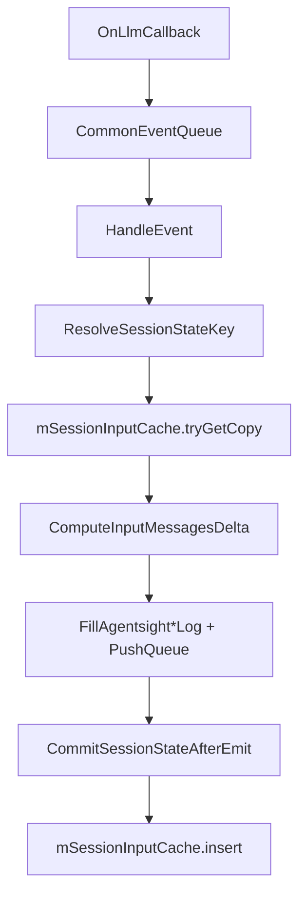
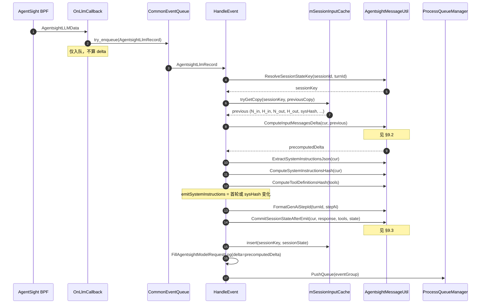
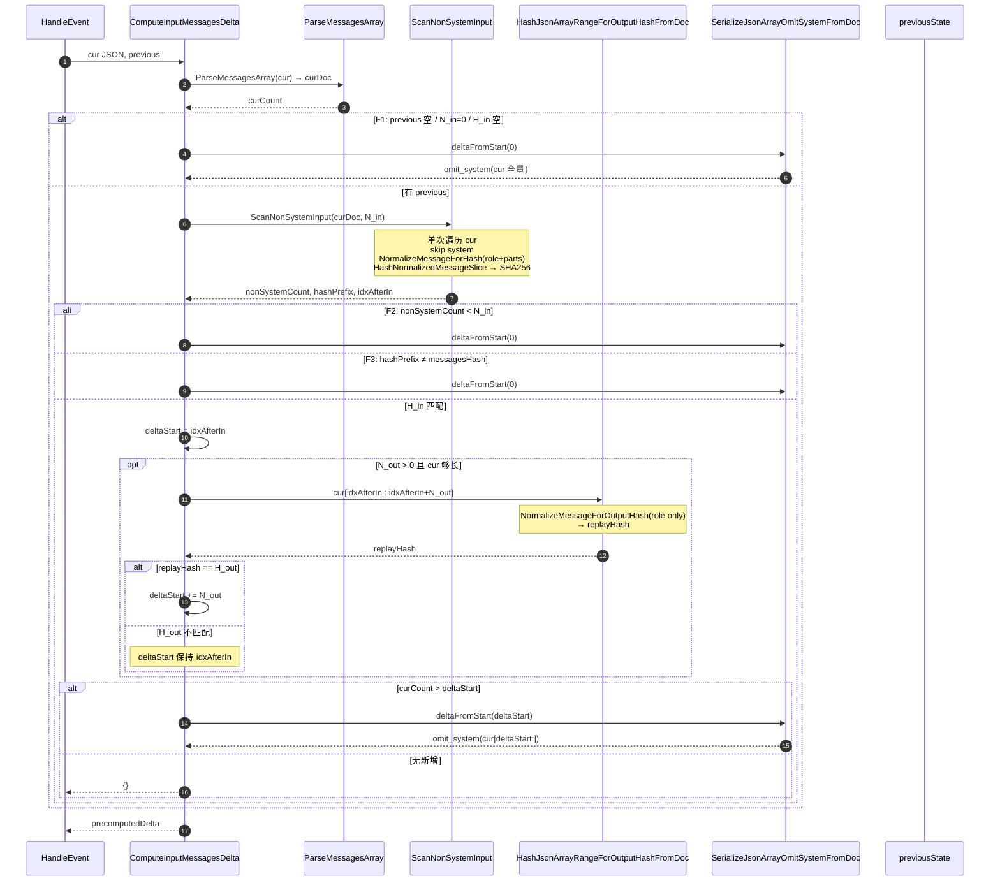
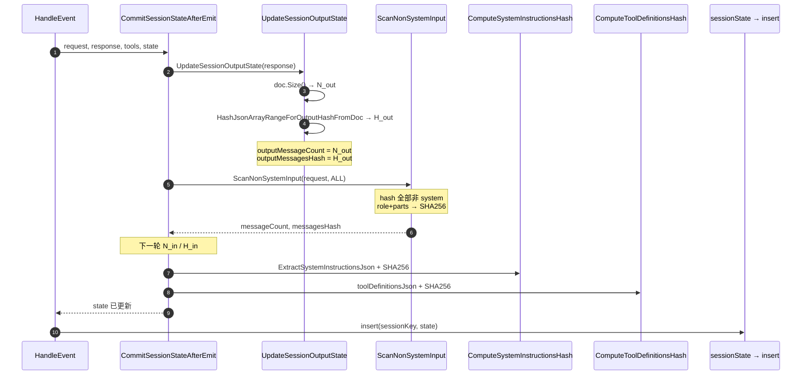

# AgentSight `gen_ai.input.messages_delta` 本地计算流程

> LoongCollector 在 C++ 侧本地推导 `gen_ai.input.messages_delta`，不依赖 AgentSight FFI 的 delta 字段。配置项 `MessageDeltaOnly=true`（默认）时日志只写 delta，不写完整 `gen_ai.input.messages`。`omit_sys_hash` 修复后，**H_in 与 LRU 中的 `messageCount` / `messagesHash` 均只统计非 system 消息**；system 内容由独立的 `systemInstructionsHash` 跟踪，且 delta 序列化时始终 omit system。

**实现位置**：`core/ebpf/plugin/agentsight/AgentsightMessageUtil.{h,cpp}`、`AgentsightManager.cpp`（`HandleEvent` 中的 LRU 读写）。

---

## 1. 端到端流程

内核 AgentSight 通过 `handle_read` 回调 `OnLlmCallback`，该函数**仅**将 LLM 事件入队，不做 delta 计算。完整链路在 `HandleEvent` 中执行：



| 步骤 | 函数 / 组件 | 作用 |
|------|-------------|------|
| 1 | `OnLlmCallback` | 构造 `AgentsightLlmRecord`，`try_enqueue` 到 `mCommonEventQueue` |
| 2 | `HandleEvent` | 从队列取出 record，读取 `mMessageDeltaOnly` 等配置 |
| 3 | `ResolveSessionStateKey(sessionId, turnId)` | LRU key：优先 `gen_ai.session.id`，否则 `gen_ai.turn.id` |
| 4 | `mSessionInputCache.tryGetCopy(key, previousCopy)` | 取上一轮已提交的 `AgentsightSessionInputState`（最多 4096 条 LRU） |
| 5 | `ComputeInputMessagesDelta(cur, previous)` | 本地计算 `precomputedDelta` |
| 6 | 写日志 | `gen_ai.input.messages_delta` ← delta；`MessageDeltaOnly=false` 时额外写完整 `gen_ai.input.messages` |
| 7 | `CommitSessionStateAfterEmit` | 更新 H_in / H_out / system / tool hash，再 `insert` 回 LRU |

**注意**：`CommitSessionStateAfterEmit` 在 `PushQueue` **之前**执行。若入队失败，本轮 delta 状态仍会前进；需要完整 input 保真时应设 `MessageDeltaOnly=false`（见 `AgentsightManager.cpp` 注释）。

---

## 2. 核心概念

| 符号 / 字段 | 含义 |
|-------------|------|
| **cur** | 当前 HTTP 请求的 `gen_ai.input.messages` JSON 数组 |
| **delta** | 本轮新增、待上报的非 system 消息子序列（`SerializeJsonArrayOmitSystemFromDoc`） |
| **prev_in** | 上一轮 **request** 中的非 system 消息（LRU：`messageCount` + `messagesHash`） |
| **prev_out** | 上一轮 **response** 消息（LRU：`outputMessageCount` + `outputMessagesHash`） |
| **N_in** | `previousState->messageCount`：上一轮 request 里**非 system** 消息条数 |
| **N_out** | `previousState->outputMessageCount`：上一轮 response 消息条数 |
| **idxAfterIn** | `ScanNonSystemInput(cur, N_in).idxAfterHashPrefix`：cur 数组中，第 N_in 条非 system 消息**之后**的下标 |

### LRU 字段（`AgentsightSessionInputState`）

| 字段 | 写入时机 | 用途 |
|------|----------|------|
| `messageCount` | `CommitSessionStateAfterEmit` | 当前轮 request 的非 system 条数 → 下一轮 N_in |
| `messagesHash` | 同上 | 当前轮全部非 system 消息的 H_in → 下一轮前缀比对 |
| `outputMessageCount` | `UpdateSessionOutputState` | 当前轮 response 条数 → 下一轮 N_out |
| `outputMessagesHash` | 同上 | 当前轮 response 的 H_out → 跳过 replay 切片 |
| `systemInstructionsHash` | `CommitSessionStateAfterEmit` | 独立跟踪 system 变更，决定是否 emit `gen_ai.system_instructions` |
| `toolDefinitionsHash` | 同上 | 独立跟踪 tool defs 变更 |
| `lastTurnId` / `nextStepNumber` / `nextEventSequence` | `HandleEvent` | `gen_ai.step.id` 与 EventStream 序号 |

---

## 3. `ComputeInputMessagesDelta` 三分支（回退到全量 delta）

设 `deltaFromStart(i) = SerializeJsonArrayOmitSystemFromDoc(cur, i)`。下列三种情况**一律** `return deltaFromStart(0)`（等价于 omit system 后的完整 cur）：

| # | 条件 | 典型场景 |
|---|------|----------|
| **F1** | `previous == nullptr` 或 `messageCount == 0` 或 `messagesHash.empty()` | 会话首包、LRU miss、状态未初始化 |
| **F2** | `scan.nonSystemCount < prevInCount` | 历史被 compact / 非 system 条数变少 |
| **F3** | `scan.hashPrefix != previousState->messagesHash` | 前 N_in 条非 system 内容与上一轮不一致（内容被改写或前缀对不上） |

**匹配路径**（非回退）：F1–F3 均不满足，且 `scan.hashPrefix == messagesHash` 时：

```
cur ≈ prev_in_non_system || replay_out || delta_new
```

1. `deltaStart = idxAfterIn`（H_in 前缀之后）。
2. 若 `prevOutCount > 0` 且 cur 在 `idxAfterIn` 处有足够消息：
   - 计算 `replayHash = H_out(cur[idxAfterIn : idxAfterIn + N_out])`（**仅 role** 归一化）。
   - 若 `replayHash == outputMessagesHash`（或 `outputMessagesHash` 为空时的兼容分支），则 `deltaStart += N_out`，跳过 replay 切片。
   - 若 H_out 不匹配，**保留** `idxAfterIn` 起的一切消息（避免漏报）。
3. `curCount > deltaStart` → `deltaFromStart(deltaStart)`；否则返回空 delta。

---

## 4. `ScanNonSystemInput` 单次扫描

一次遍历 `cur` 数组，同时完成计数与哈希：

| 输出字段 | 含义 |
|----------|------|
| `nonSystemCount` | 跳过 `role==system` 后的消息总数 |
| `hashPrefix` | 对前 `hashPrefixCount` 条非 system 消息做 H_in（role+parts 归一化后 SHA-256）；`hashPrefixCount == SIZE_MAX` 时哈希**全部**非 system |
| `idxAfterHashPrefix` | 已哈希的第 `hashPrefixCount` 条非 system 消息在**原数组**中的下一个下标 |

**规则摘要**：

- 遇到 system → 跳过（不计数、不参与 hash）。
- `hashPrefixCount == kHashAllNonSystemMessages` → 哈希所有非 system（用于 `CommitSessionStateAfterEmit`）。
- 非 system 条数不足 `hashPrefixCount` → `idxAfterHashPrefix = doc.Size()`。

---

## 5. H_in、H_out 与 `systemInstructionsHash` 分离

| 哈希 | 归一化 | 覆盖范围 | 用途 |
|------|--------|----------|------|
| **H_in** (`messagesHash`) | 每条保留 `role` + `parts` | request 中**全部非 system** 消息 | 判断 cur 前缀是否等于 prev_in |
| **H_out** (`outputMessagesHash`) | 每条仅保留 `role` | 上一轮 response 全量 | 判断 cur 中 replay 切片是否等于 prev_out（容忍 parts/id 差异，如 OpenClaw `call_abc` vs `callabc`） |
| **systemInstructionsHash** | 原始 system 消息 JSON 的 SHA-256 | 所有 `role==system` 消息 | 与 H_in **无关**；system 变更不影响 N_in/H_in，但会触发重新 emit `gen_ai.system_instructions` |

**omit_sys_hash 要点**：system 不参与 H_in 计数与前缀匹配，因此 OpenClaw 在 heartbeat 与 webchat 之间切换 system prompt 时，只要非 system 前缀不变，仍走匹配路径而非 F3 全量回退。

Delta 输出：`SerializeJsonArrayOmitSystemFromDoc` 从 `deltaStart` 起序列化，**再次**跳过 system 行。

---

## 6. OpenClaw heartbeat → webchat 示例

单元测试 `TestComputeDeltaWhenSystemChanges` 模拟的场景：

**Round 1（heartbeat）**

```json
// request
[{"role":"system","content":"heartbeat-system"},{"role":"user","content":"a"}]
// response
[{"role":"assistant","content":"HEARTBEAT_OK"}]
```

`CommitSessionStateAfterEmit` 后：N_in=1（user `a`），H_in 不含 system；N_out=1，H_out=assistant。

**Round 2（webchat，system 已换）**

```json
// request cur
[
  {"role":"system","content":"webchat-system"},
  {"role":"user","content":"a"},
  {"role":"assistant","content":"HEARTBEAT_OK"},
  {"role":"user","content":"今天天气如何"}
]
```

| 检查 | 结果 |
|------|------|
| F1–F3 | 均不触发（H_in 仍匹配 user `a`） |
| H_out replay | `assistant/HEARTBEAT_OK` 与 Round 1 response 的 role 一致 → 跳过 |
| **delta** | 仅 `[{"role":"user","content":"今天天气如何"}]`（无 system、无旧 user、无 replay assistant） |

`systemInstructionsHash` 变化会令 Round 2 重新 emit system instructions，但不影响 delta 切分。

---

## 7. Delta 起点速查表

| 场景 | `deltaStart` | 产出 |
|------|--------------|------|
| F1 首包 / 无 LRU 状态 | `0` | omit system 后的完整 cur |
| F2 非 system 条数缩水 | `0` | 同上（全量回退） |
| F3 H_in 前缀不匹配 | `0` | 同上 |
| H_in 匹配 + H_out 匹配 | `idxAfterIn + N_out` | 仅 cur 中 replay 之后的新消息 |
| H_in 匹配 + H_out 不匹配 | `idxAfterIn` | replay 区 + 新消息（宁可多报，不漏） |
| H_in 匹配 + 无新消息 | — | 空 delta `{}` / `[]` |

---

## 8. E2E 校验公式

`run_scripts/agentsight_e2e/verify_delta_baseline.py` 使用的恒等式（同一 `gen_ai.session.id` 内，按 HTTP 请求序）：

```
canon( omit_system(prev_in) + prev_out + delta ) == canon( omit_system(cur) )
```

| 符号 | 来源 |
|------|------|
| `prev_in` | 上一轮 request 的 `gen_ai.input.messages`（split 格式） |
| `prev_out` | 上一轮 response 的 `gen_ai.output.messages`（须配对，不能取错行） |
| `delta` / `cur` | 当前 request 行 |
| 首包 | `delta == omit_system(cur)` |

**校验前提**：`EventStreamFormat=true` 且 `MessageDeltaOnly=false`（需要完整 `gen_ai.input.messages` 才能还原 cur）。`MessageDeltaOnly=true` 时日志无 cur，无法用该公式做 E2E 对账。

---

## 9. 时序图：函数调用与计算内容

### 9.1 端到端（HandleEvent 一轮 LLM）



### 9.2 ComputeInputMessagesDelta（算 delta）



**本轮算了什么（delta 路径）**

| 步骤 | 函数 | 输入 | 产出 |
|------|------|------|------|
| parse | `ParseMessagesArray` | cur 字符串 | `curDoc`, `curCount` |
| 扫描 | `ScanNonSystemInput(cur, N_in)` | 前 N_in 条**非 system** | `hashPrefix`(H_in), `idxAfterIn`, `nonSystemCount` |
| 比对 | — | `hashPrefix` vs LRU `messagesHash` | 决定走匹配还是 F3 全量 |
| replay | `HashJsonArrayRangeForOutputHashFromDoc` | `cur[idxAfterIn:idxAfterIn+N_out]` | `replayHash`(H_out) vs LRU `outputMessagesHash` |
| 输出 | `SerializeJsonArrayOmitSystemFromDoc` | 从 `deltaStart` 切片 | **delta JSON**（无 system） |

### 9.3 CommitSessionStateAfterEmit（写 LRU，供下一轮）



**Commit 算了什么**

| 字段 | 函数链 | 覆盖范围 |
|------|--------|----------|
| `outputMessageCount`, `outputMessagesHash` | `UpdateSessionOutputState` | response 全量，H_out **role-only** |
| `messageCount`, `messagesHash` | `ScanNonSystemInput(ALL)` | request **全部非 system**，H_in **role+parts** |
| `systemInstructionsHash` | `ComputeSystemInstructionsHash` | 所有 system 消息 JSON |
| `toolDefinitionsHash` | `ComputeToolDefinitionsHash` | tools JSON 原文 |

---

## 参考

- 单元测试：`core/unittest/ebpf/AgentsightMessageUtilUnittest.cpp`
- E2E 脚本：`run_scripts/agentsight_e2e/verify_delta_baseline.py`
- 插件配置：`MessageDeltaOnly` / `EventStreamFormat`（`SecurityOptions`）
